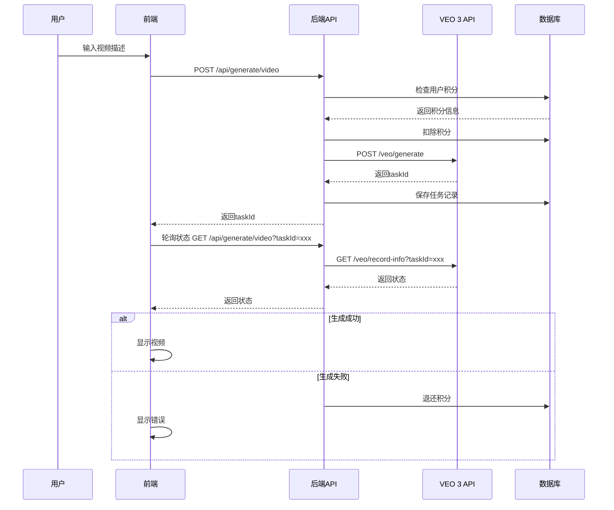

# 🎬 VEO 3 API集成指南

## 📋 目录

- [概述](#概述)
- [前置要求](#前置要求)
- [API密钥获取](#api密钥获取)
- [环境配置](#环境配置)
- [API接口说明](#api接口说明)
- [集成流程](#集成流程)
- [测试指南](#测试指南)
- [常见问题](#常见问题)
- [定价说明](#定价说明)

---

## 📖 概述

本指南将帮助您将真实的Google VEO 3 API集成到VEO AI平台中，实现真正的AI视频生成功能。

### 什么是VEO 3 API？

VEO 3是Google最新的视频生成AI模型，通过API接口提供：
- 文本转视频生成
- 图片参考视频生成
- 多种宽高比支持（16:9, 9:16, 1:1）
- 高质量1080P视频输出
- Fast/Turbo快速模式和Quality高质量模式

---

## 🔑 前置要求

在开始集成之前，确保您具备：

- ✅ 已完成VEO AI平台的基础开发
- ✅ 拥有可用的Supabase账号和数据库
- ✅ 了解基本的Next.js和TypeScript开发
- ✅ 拥有有效的支付方式（用于购买VEO积分）

---

## 🎫 API密钥获取

### 步骤1：注册VEO 3 API账号

1. **访问官方网站**
   - 打开 https://veo3api.ai/zh-CN
   - 或访问 https://docs.veo3api.ai/cn/quickstart

2. **注册账号**
   - 点击"注册"或"Get Started"
   - 填写邮箱和密码
   - 验证邮箱

3. **充值积分**
   - 登录后台
   - 选择充值套餐
   - 完成支付

### 步骤2：获取API密钥

1. 登录VEO 3 API控制台
2. 导航到"API密钥"页面
3. 点击"创建新密钥"
4. 复制生成的API密钥（格式: `veo_xxxxxxxxxxxxxxxx`）
5. ⚠️ **重要**: 妥善保管API密钥，不要泄露！

---

## ⚙️ 环境配置

### 1. 更新`.env`文件

在项目根目录的`.env`文件中添加以下配置：

```env
# VEO 3 API配置
VEO_API_URL=https://api.veo3api.ai/api/v1
VEO_API_KEY=veo_your_actual_api_key_here

# 确保以下配置也正确
NEXTAUTH_URL=http://localhost:3000  # 本地开发
# NEXTAUTH_URL=https://your-domain.com  # 生产环境
NEXTAUTH_SECRET=your-nextauth-secret-key
```

### 2. 验证配置

创建测试脚本 `test-veo-api.js`：

```javascript
const VEO_API_URL = "https://api.veo3api.ai/api/v1"
const VEO_API_KEY = "veo_your_actual_api_key_here"

async function testVeoAPI() {
  try {
    // 测试查询积分
    const response = await fetch(`${VEO_API_URL}/common/credit`, {
      method: 'GET',
      headers: {
        'Authorization': `Bearer ${VEO_API_KEY}`
      }
    })

    const result = await response.json()
    console.log('✅ VEO API连接成功！')
    console.log('剩余积分:', result.data)
  } catch (error) {
    console.error('❌ VEO API连接失败:', error.message)
  }
}

testVeoAPI()
```

运行测试：
```bash
node test-veo-api.js
```

---

## 🔌 API接口说明

### 1. 视频生成接口

**端点**: `POST /api/v1/veo/generate`

**请求头**:
```json
{
  "Authorization": "Bearer YOUR_API_KEY",
  "Content-Type": "application/json"
}
```

**请求体**:
```json
{
  "prompt": "一只金毛猎犬在阳光明媚的公园里玩接球游戏，慢动作，电影级照明",
  "model": "veo3",
  "aspectRatio": "16:9",
  "watermark": "MyBrand"
}
```

**参数说明**:
- `prompt` (必需): 视频描述文本，最多500字符
- `model` (可选): 模型名称，默认"veo3"
- `aspectRatio` (可选): 宽高比，可选值: "16:9", "9:16", "1:1"
- `watermark` (可选): 水印文字

**响应**:
```json
{
  "code": 200,
  "data": {
    "taskId": "task_abc123xyz"
  },
  "msg": "success"
}
```

### 2. 状态查询接口

**端点**: `GET /api/v1/veo/record-info?taskId={taskId}`

**请求头**:
```json
{
  "Authorization": "Bearer YOUR_API_KEY"
}
```

**响应**:
```json
{
  "code": 200,
  "data": {
    "successFlag": 1,
    "response": {
      "resultUrls": [
        "https://storage.veo3api.ai/videos/xxx.mp4"
      ],
      "taskId": "task_abc123xyz"
    }
  },
  "msg": "success"
}
```

**successFlag说明**:
- `0`: 处理中
- `1`: 成功
- `2`: 失败

### 3. 1080P高清视频获取

**端点**: `GET /api/v1/veo/get-1080p-video?taskId={taskId}&index=0`

**说明**: 仅适用于16:9宽高比的视频

**响应**:
```json
{
  "code": 200,
  "data": {
    "resultUrl": "https://storage.veo3api.ai/videos/xxx_1080p.mp4"
  },
  "msg": "success"
}
```

### 4. 积分查询接口

**端点**: `GET /api/v1/common/credit`

**响应**:
```json
{
  "code": 200,
  "data": 1234.5,
  "msg": "success"
}
```

---

## 🔄 集成流程

### 完整的视频生成流程



### 代码集成步骤

#### 1. 前端调用示例

```typescript
// src/app/generate/page.tsx
const generateVideo = async () => {
  try {
    setGenerating(true)
    
    // 调用后端API
    const response = await fetch('/api/generate/video', {
      method: 'POST',
      headers: {
        'Content-Type': 'application/json'
      },
      body: JSON.stringify({
        prompt: videoDescription,
        images: referenceImages,
        aspectRatio: selectedAspectRatio,
        duration: selectedDuration
      })
    })

    const data = await response.json()
    
    if (data.success) {
      // 开始轮询状态
      pollVideoStatus(data.taskId)
    } else {
      showError(data.error)
    }
  } catch (error) {
    showError('视频生成失败')
  }
}

// 轮询状态
const pollVideoStatus = async (taskId: string) => {
  const interval = setInterval(async () => {
    const response = await fetch(`/api/generate/video?taskId=${taskId}`)
    const data = await response.json()

    if (data.status === 'completed') {
      clearInterval(interval)
      setVideoUrl(data.videoUrl)
      setGenerating(false)
    } else if (data.status === 'failed') {
      clearInterval(interval)
      showError(data.error)
      setGenerating(false)
    }
  }, 30000) // 每30秒查询一次
}
```

#### 2. 后端已集成

后端API已经完成集成，位于：
- `src/app/api/generate/video/route.ts` - 视频生成和状态查询
- `src/app/api/webhooks/veo/route.ts` - Webhook回调处理
- `src/app/api/veo/get-1080p/route.ts` - 1080P高清视频获取
- `src/app/api/veo/check-credits/route.ts` - VEO积分查询

---

## 🧪 测试指南

### 1. 本地测试

```bash
# 1. 启动开发服务器
npm run dev

# 2. 访问视频生成页面
open http://localhost:3000/generate

# 3. 测试步骤
- 输入视频描述
- 选择宽高比
- 点击生成
- 等待视频生成完成
- 下载或分享视频
```

### 2. API测试

使用cURL测试API：

```bash
# 查询VEO积分
curl -X GET "https://api.veo3api.ai/api/v1/common/credit" \
  -H "Authorization: Bearer YOUR_API_KEY"

# 生成视频
curl -X POST "https://api.veo3api.ai/api/v1/veo/generate" \
  -H "Authorization: Bearer YOUR_API_KEY" \
  -H "Content-Type: application/json" \
  -d '{
    "prompt": "测试视频：一只猫在玩球",
    "model": "veo3",
    "aspectRatio": "16:9"
  }'

# 查询状态
curl -X GET "https://api.veo3api.ai/api/v1/veo/record-info?taskId=YOUR_TASK_ID" \
  -H "Authorization: Bearer YOUR_API_KEY"
```

### 3. Webhook测试

配置Webhook URL（生产环境）：

```
https://your-domain.com/api/webhooks/veo
```

本地测试可使用ngrok：

```bash
# 安装ngrok
npm install -g ngrok

# 启动ngrok
ngrok http 3000

# 使用ngrok提供的URL作为Webhook地址
# 例如: https://abc123.ngrok.io/api/webhooks/veo
```

---

## ❓ 常见问题

### Q1: 视频生成失败，提示"VEO API密钥未配置"

**解决方案**:
1. 检查`.env`文件中是否正确设置了`VEO_API_KEY`
2. 重启开发服务器: `npm run dev`
3. 确保API密钥格式正确（应以`veo_`开头）

### Q2: 积分不足

**解决方案**:
1. 访问VEO 3 API控制台查询剩余积分
2. 充值积分
3. 或使用内部积分系统（本平台积分 ≠ VEO积分）

### Q3: 视频生成很慢

**说明**:
- Fast/Turbo模式: 通常30-60秒
- Quality模式: 可能需要2-5分钟
- 建议使用Webhook而不是轮询

### Q4: 如何获取1080P高清视频？

**步骤**:
```typescript
const response = await fetch(`/api/veo/get-1080p?taskId=${taskId}`)
const data = await response.json()
const hdVideoUrl = data.hdVideoUrl
```

**注意**: 仅支持16:9宽高比的视频

### Q5: Webhook没有收到回调

**检查清单**:
- ✅ Webhook URL是否可公网访问
- ✅ URL是否配置正确（需要HTTPS）
- ✅ 服务器防火墙是否开放
- ✅ 查看服务器日志

---

## 💰 定价说明

### VEO 3 API积分消耗

| 模式 | 时长 | 消耗积分 | 生成时间 |
|------|------|---------|----------|
| Fast/Turbo | 5秒 | ~1积分 | 30-60秒 |
| Fast/Turbo | 10秒 | ~2积分 | 60-90秒 |
| Quality | 5秒 | ~5积分 | 2-3分钟 |
| Quality | 10秒 | ~10积分 | 3-5分钟 |

### 成本计算示例

假设购买100积分：

**Fast模式**:
- 价格: ¥99/100积分
- 可生成: 约50个5秒视频
- 单个成本: ¥1.98/视频

**Quality模式**:
- 可生成: 约10个5秒视频
- 单个成本: ¥9.9/视频

### 建议

1. **开发测试**: 使用Fast模式
2. **正式发布**: 使用Quality模式
3. **批量生成**: 购买大额套餐享受折扣

---

## 📚 相关文档

- [VEO 3 API官方文档](https://docs.veo3api.ai/cn/)
- [快速开始指南](https://docs.veo3api.ai/cn/quickstart)
- [API参考](https://docs.veo3api.ai/cn/api-reference)

---

## 🎉 下一步

完成集成后，您可以：

1. ✅ 测试完整的视频生成流程
2. ✅ 配置Webhook自动通知
3. ✅ 优化用户体验（进度条、预览等）
4. ✅ 部署到生产环境
5. ✅ 开始商业化运营

祝您集成顺利！如有问题，欢迎联系技术支持。🚀


